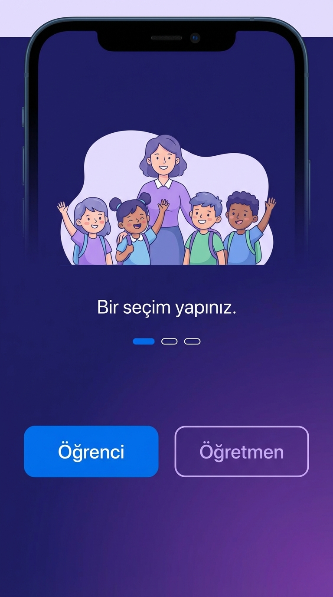
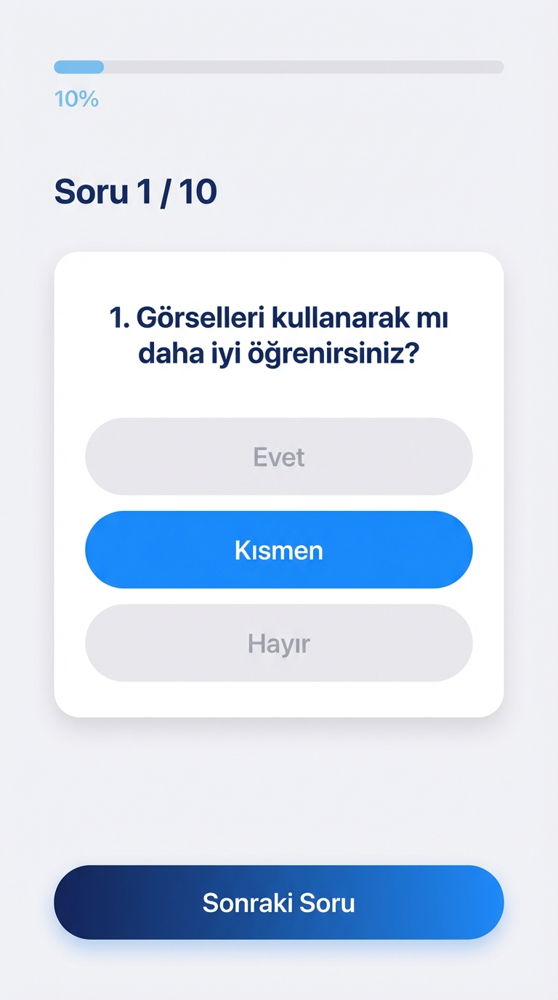
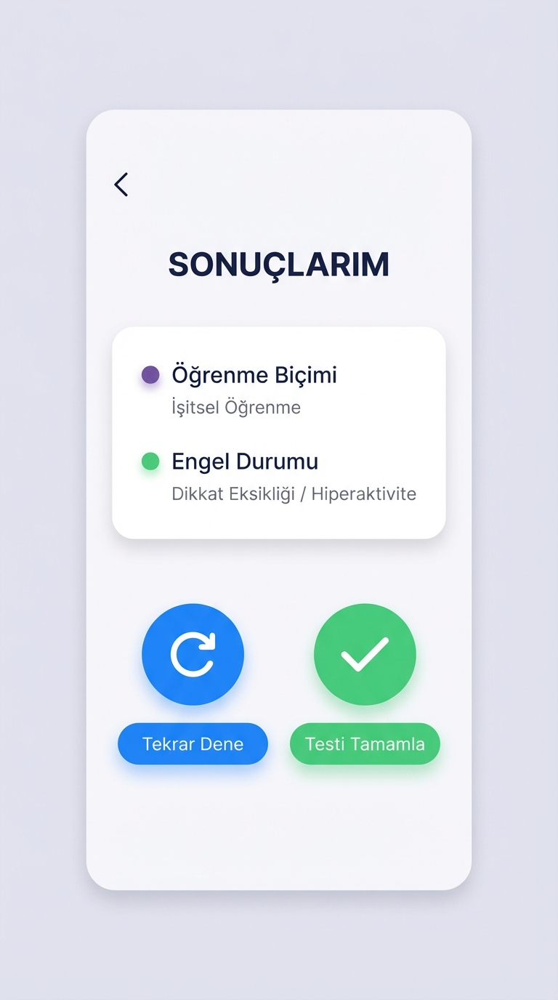
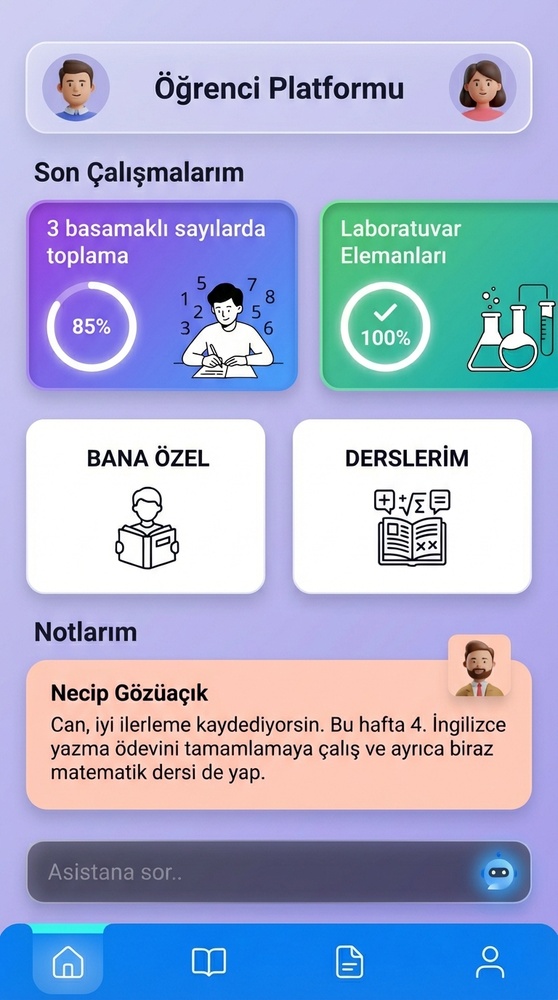
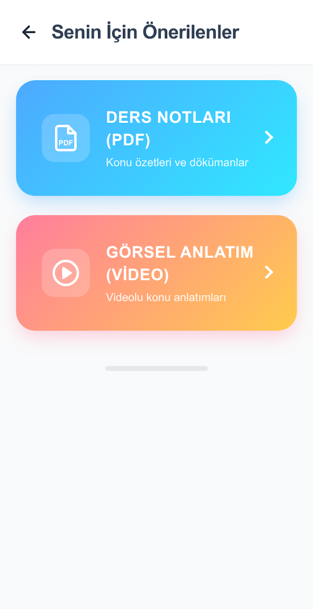
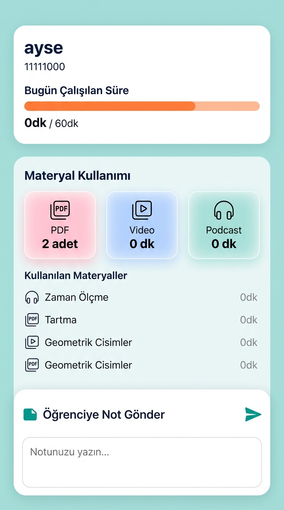

# Smart-Edu


---

<!-- TÜRKÇE VERSİYON -->

## Turkce

### Proje Hakkinda

Smart-Edu, görme engeli, işitsel engel, fiziksel engel, ADHD ve öğrenme güçlüğü gibi çeşitli engel durumları nedeniyle eğitimine verim alarak devam edemeyen öğrencilere yönelik geliştirilmiş, kişiselleştirilmiş bir mobil eğitim platformudur. Proje, TÜBİTAK 2209-A Üniversite Öğrencileri Araştırma Projeleri Destekleme Programı tarafından kabul edilmiştir.

Sistemin temel yaklaşımı, her öğrencinin öğrenme biçimini ve engel durumunu tespit eden özgün bir analiz algoritması aracılığıyla içerikleri (video, PDF, podcast) ve soru bankası parametrelerini otomatik olarak uyarlamaktır. Bu sayede standart bir müfredat yerine, bireyin ihtiyacına özgü bir öğrenme deneyimi sunulmaktadır.

Platform, öğrenci ve öğretmen olmak üzere iki ayrı kullanıcı rolüne sahiptir ve Firebase altyapısı üzerine Flutter ile geliştirilmiştir.

---

### Temel Ozellikler

**Ogrenci Tarafı:**

- Öğrenme stili ve engel durumu değerlendirmesi (tek seferlik, sistemin çekirdek bileşeni)
- Değerlendirme sonucuna göre otomatik içerik uyarlaması ("Bana Özel" modu)
- Standart müfredat erişimi ("Derslerim" modu)
- Beş içerik türü: konu anlatımı, soru bankası, alıştırmalar, laboratuvar, yapay zeka destekli öğrenme
- Google Gemini 1.5 Flash entegrasyonu ile yapay zeka destekli konu açıklamaları
- Video, PDF ve podcast formatında materyal desteği
- Türkçe Metin-Okuma (TTS) erişilebilirlik sistemi (görme engelli öğrenciler için otomatik aktivasyon)
- Öğretmen notu alma sistemi

**Ogretmen Tarafı:**

- Öğrenci arama, ekleme ve yönetimi
- Bireysel öğrenci ilerleme raporları (günlük çalışma süresi, materyal kullanımı, test skorları)
- Gerçek zamanlı öğrenci etkinlik takibi
- Öğrencilere not gönderme

---

### Ekran Goruntuleri

Aşağıdaki placeholder'ları kendi ekran görüntülerinizin URL veya dosya yoluyla değiştirin.

**Kullanici Giris Akisi**

| Rol Seçimi | Oğrenme Stili Testi | Analiz Sonucu |
|:---:|:---:|:---:|
|  |  |  |

**Ana Platform Ekranlari**

| Oğrenci Ana Menü | Ders İçerik Merkezi | Öğretmen Analitik Paneli |
|:---:|:---:|:---:|
|  |  |  |

---

### Teknoloji Yigini

| Katman | Teknoloji | Versiyon | Acıklama |
|--------|-----------|----------|----------|
| Mobil Framework | Flutter | 3.6+ | Dart 3.6+ ile çapraz platform |
| Kimlik Doğrulama | Firebase Auth | 5.5.1 | E-posta/şifre tabanlı |
| Veritabanı | Cloud Firestore | 5.6.5 | Gerçek zamanlı NoSQL |
| Dosya Depolama | Firebase Storage | 12.4.6 | Materyal dosyaları |
| Yapay Zeka | Google Generative AI (Gemini) | 0.3.0 | Gemini 1.5 Flash |
| Metin-Okuma | flutter_tts | 4.2.5 | Türkçe (tr-TR), hız 0.5 |
| Video Oynatıcı | video_player | 2.8.5 | Ders videoları |
| Ses Oynatıcı | just_audio | 0.10.5 | Podcast içerikleri |
| PDF Görüntüleyici | flutter_pdfview | 1.2.7+2 | PDF materyalleri |
| Markdown Render | flutter_markdown | 0.6.11 | Gemini çıktı formatı |
| Navigasyon | curved_navigation_bar | 1.0.6 | Alt navigasyon çubuğu |
| Grid Düzeni | flutter_staggered_grid_view | 0.7.0 | İçerik kartları |
| Yerel Depolama | sqflite | 2.3.3 | Yerel önbellekleme altyapısı |
| HTTP İstekleri | http | 1.4.0 | Harici API çağrıları |

---

### Kurulum

**Gereksinimler:** Flutter SDK 3.6+, Dart SDK 3.6+, Android Studio veya VS Code, bağlı Android cihaz veya emülatör (minSdk 24)

**Adim 1 — Depoyu klonlayın**

```bash
git clone https://github.com/KULLANICI_ADINIZ/Smart-Edu.git
cd Smart-Edu
```

**Adim 2 — Bağımlılıkları yükleyin**

```bash
flutter pub get
```

**Adim 3 — Firebase yapılandırması**

`lib/firebase_options.dart` dosyası mevcut Firebase projesi için yapılandırılmıştır. Kendi Firebase projenizi kullanmak istiyorsanız:

```bash
dart pub global activate flutterfire_cli
flutterfire configure
```

**Adim 4 — Uygulamayı çalıştırın**

```bash
flutter run
```

Sürüm (release) derlemesi için:

```bash
flutter build apk
```

---

### Mimari Genel Bakis

```
main.dart → Splash (3s) → OnboardingScreen (Rol Seçimi)
  |
  |-- Oğrenci Yolu
  |     SWelcomeScreen → Giriş/Kayıt → SurveyPage → DisabilityScreen
  |     → ResultScreen → SMainMenuScreen
  |           |-- Derslerim (Standart mod)
  |           |-- Bana Özel (Kişiselleştirilmiş mod)
  |           |-- Profil / Notlar
  |
  |-- Oğretmen Yolu
        TWelcomeScreen → Giriş/Kayıt → TMainMenuScreen
              |-- Öğrencilerim (Arama, Ekleme, Yönetim)
              |-- Öğrenci Sonuçları (Analitik Raporlar)
              |-- Not Gönderme
```

Servisler katmanı (`lib/services/`) yedi bileşen içermektedir: `auth`, `tts_service`, `activity_tracking_service`, `recommendation_service`, `teacher_student_service`, `teacher_notes_service`, `reporting_service`. Detaylı mimari açıklama için `TECHNICAL_REPORT.md` dosyasına bakınız.

---

### TUBITAK 2209-A Destegi

Bu proje, TÜBİTAK 2209-A Üniversite Öğrencileri Araştırma Projeleri Destekleme Programı kapsamında kabul edilmiş ve desteklenmiştir. Program, üniversite öğrencilerinin özgün araştırma projelerini hayata geçirmelerine olanak tanımaktadır.

---

### Lisans

Bu proje MIT Lisansı kapsamında lisanslanmıştır. Ayrıntılar için `LICENSE` dosyasına bakınız.

---

---

<!-- ENGLISH VERSION -->

## English

### About the Project

Smart-Edu is a personalized mobile education platform developed for students who struggle to benefit from conventional education due to various disabilities, including visual impairment, hearing impairment, physical disability, ADHD, and learning difficulties. The project has been accepted by TÜBİTAK (The Scientific and Technological Research Council of Türkiye) under the 2209-A University Students Research Projects Support Program.

The core approach of the system is to automatically adapt content types (video, PDF, podcast) and question bank parameters through an original analysis algorithm that identifies each student's learning style and disability status. Rather than a one-size-fits-all curriculum, the platform delivers a learning experience tailored to the individual's specific needs.

The platform supports two distinct user roles — Student and Teacher — and is built with Flutter on top of a Firebase backend.

---

### Key Features

**Student Side:**

- Learning style and disability status assessment (one-time, core component of the system)
- Automatic content adaptation based on assessment results ("For You" mode)
- Standard curriculum access ("My Lessons" mode)
- Five content types: topic explanation, question bank, exercises, laboratory, AI-assisted learning
- AI-assisted topic explanations powered by Google Gemini 1.5 Flash
- Video, PDF, and podcast format support
- Turkish Text-to-Speech (TTS) accessibility system (auto-activation for visually impaired students)
- Teacher note reception system

**Teacher Side:**

- Student search, enrollment, and management
- Individual student progress reports (daily study duration, material usage, test scores)
- Real-time student activity monitoring
- Note sending to students

---

### Screenshots

Replace the placeholders below with your own screenshot URLs or file paths.

**User Onboarding Flow**

| Role Selection | Learning Style Assessment | Analysis Result |
|:---:|:---:|:---:|
|  |  |  |

**Core Platform Screens**

| Student Dashboard | Lesson Content Hub | Teacher Analytics Panel |
|:---:|:---:|:---:|
|  |  |  |

---

### Technology Stack

| Layer | Technology | Version | Description |
|-------|-----------|---------|-------------|
| Mobile Framework | Flutter | 3.6+ | Cross-platform with Dart 3.6+ |
| Authentication | Firebase Auth | 5.5.1 | Email/password based |
| Database | Cloud Firestore | 5.6.5 | Real-time NoSQL |
| File Storage | Firebase Storage | 12.4.6 | Educational materials |
| Artificial Intelligence | Google Generative AI (Gemini) | 0.3.0 | Gemini 1.5 Flash |
| Text-to-Speech | flutter_tts | 4.2.5 | Turkish (tr-TR), rate 0.5 |
| Video Player | video_player | 2.8.5 | Lesson videos |
| Audio Player | just_audio | 0.10.5 | Podcast content |
| PDF Viewer | flutter_pdfview | 1.2.7+2 | PDF materials |
| Markdown Rendering | flutter_markdown | 0.6.11 | Gemini output format |
| Navigation | curved_navigation_bar | 1.0.6 | Bottom navigation bar |
| Grid Layout | flutter_staggered_grid_view | 0.7.0 | Content cards |
| Local Storage | sqflite | 2.3.3 | Local caching infrastructure |
| HTTP Requests | http | 1.4.0 | External API calls |

---

### Installation

**Requirements:** Flutter SDK 3.6+, Dart SDK 3.6+, Android Studio or VS Code, connected Android device or emulator (minSdk 24)

**Step 1 — Clone the repository**

```bash
git clone https://github.com/YOUR_USERNAME/Smart-Edu.git
cd Smart-Edu
```

**Step 2 — Install dependencies**

```bash
flutter pub get
```

**Step 3 — Firebase configuration**

The `lib/firebase_options.dart` file is configured for the existing Firebase project. To use your own Firebase project:

```bash
dart pub global activate flutterfire_cli
flutterfire configure
```

**Step 4 — Run the application**

```bash
flutter run
```

For a release build:

```bash
flutter build apk
```

---

### Architecture Overview

```
main.dart → Splash (3s) → OnboardingScreen (Role Selection)
  |
  |-- Student Path
  |     SWelcomeScreen → Login/Signup → SurveyPage → DisabilityScreen
  |     → ResultScreen → SMainMenuScreen
  |           |-- My Lessons (Standard mode)
  |           |-- For You (Personalized mode)
  |           |-- Profile / Notes
  |
  |-- Teacher Path
        TWelcomeScreen → Login/Signup → TMainMenuScreen
              |-- My Students (Search, Enroll, Manage)
              |-- Student Results (Analytics Reports)
              |-- Send Notes
```

The services layer (`lib/services/`) contains seven components: `auth`, `tts_service`, `activity_tracking_service`, `recommendation_service`, `teacher_student_service`, `teacher_notes_service`, `reporting_service`. See `TECHNICAL_REPORT.md` for detailed architectural documentation.

---

### TÜBİTAK 2209-A Support

This project has been accepted and supported under the TÜBİTAK (The Scientific and Technological Research Council of Türkiye) 2209-A University Students Research Projects Support Program. The program enables university students to bring their original research projects to life.

---

### License

This project is licensed under the MIT License. See the `LICENSE` file for details.
