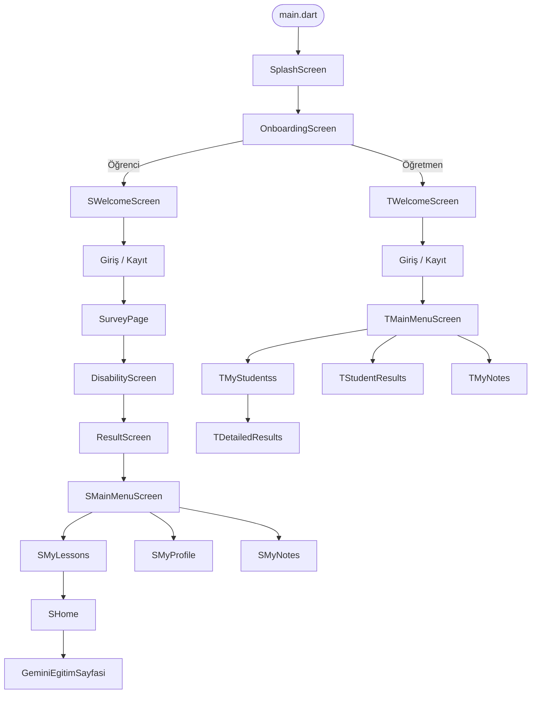
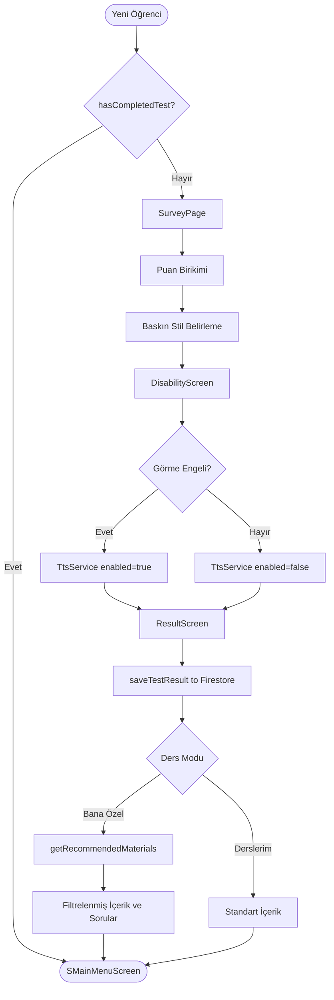
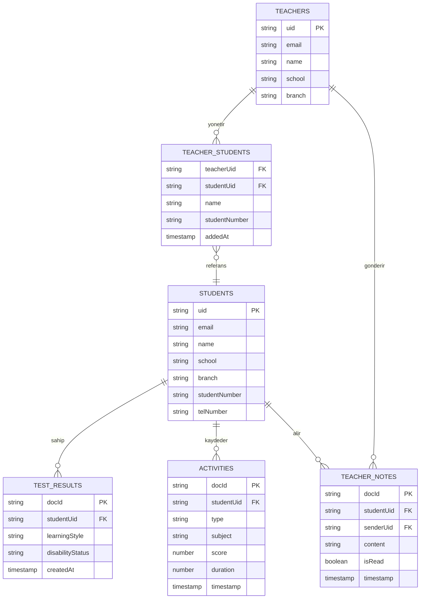

# Smart-Edu: Teknik Rapor

**Engel Durumuna ve Öğrenme Biçimine Göre Kişiselleştirilmiş Eğitim Platformu**

TÜBİTAK 2209-A Üniversite Öğrencileri Araştırma Projeleri Destekleme Programı

---

## İçerik

1. [Giriş ve Motivasyon](#1-giris-ve-motivasyon)
2. [Sistem Mimarisi](#2-sistem-mimarisi)
3. [Öğrenme Stili Analiz Algoritması](#3-ogrenme-stili-analiz-algoritmasi)
4. [Erişilebilirlik Sistemi](#4-erisilebilirlik-sistemi)
5. [Öğretmen-Öğrenci İletişim ve Analitik Sistemi](#5-ogretmen-ogrenci-iletisim-ve-analitik-sistemi)
6. [Teknoloji Yığını ve Bağımlılıklar](#6-teknoloji-yigini-ve-bagimliliklar)
7. [Veri Modeli](#7-veri-modeli)
8. [Güvenlik ve Kullanıcı İzolasyonu](#8-guvenlik-ve-kullanici-izolasyonu)
9. [Sonuç ve Gelecek Çalışmalar](#9-sonuc-ve-gelecek-calismalar)

---

## 1. Giriş ve Motivasyon

### 1.1 Problem Tanımı

Geleneksel eğitim sistemleri, içerik sunum biçimi ve öğrenme hızı açısından büyük ölçüde homojen bir yapıya sahiptir. Bu yapı, bireysel öğrenme farklılıkları göz ardı etmekte; başta görme engeli, işitsel engel, fiziksel engel, Dikkat Eksikliği ve Hiperaktivite Bozukluğu (DEHB) ve öğrenme güçlüğü olmak üzere çeşitli engel durumlarına sahip öğrenciler için ciddi bir engel oluşturmaktadır. Söz konusu öğrenciler, içeriğin sunum biçiminin kendi duyusal ve bilişsel süreçleriyle uyumsuzluğu nedeniyle eğitimden yeterince verim alamamaktadır.

### 1.2 Çözüm Yaklaşımı

Smart-Edu, bu problemi iki boyutlu bir kişiselleştirme yaklaşımıyla ele almaktadır:

**Boyut 1 — Öğrenme Stili:** Her öğrencinin birincil öğrenme modalitesi tespit edilerek içerik sunum öncelikleri buna göre belirlenmektedir.

**Boyut 2 — Engel Durumu:** Tespit edilen engel türüne göre belirli içerik formatları elenmekte veya ön plana çıkarılmakta; soru bankası parametreleri (zorluk seviyesi, görsel yoğunluk, soru adedi) uyarlanmaktadır.

Her iki boyutun kesişimi, sistemin öneri motorunu oluşturmakta ve 5x5'lik bir içerik-engel uyarlama matrisine dönüşmektedir.

### 1.3 TÜBİTAK 2209-A Bağlamı

Bu çalışma, TÜBİTAK 2209-A Üniversite Öğrencileri Araştırma Projeleri Destekleme Programı kapsamında kabul edilmiş ve finansal destek almıştır. Program, üniversite öğrencilerinin özgün araştırma ve uygulama projelerini hayata geçirmelerini teşvik etmektedir.

---

## 2. Sistem Mimarisi

### 2.1 Çift Rol Mimarisi

Platform, birbirinden bağımsız iki kullanıcı rolü üzerine inşa edilmiştir: **Öğrenci** ve **Öğretmen**. Her iki rol, ayrı kimlik doğrulama ve navigasyon akışlarına sahiptir. Rol seçimi, uygulamanın ilk çalışmasında `OnboardingScreen` üzerinden yapılmakta; seçilen rol, Firebase Firestore'daki farklı koleksiyonlara yönlendirme belirlemektedir.

### 2.2 Navigasyon Akışı

Uygulamanın tam ekran geçiş akışı aşağıdaki diyagramda gösterilmektedir:



### 2.3 Dosya Organizasyonu

```
lib/
  ├── main.dart                    # Uygulama giriş noktası, Firebase init
  ├── firebase_options.dart        # Platform-spesifik Firebase yapılandırması
  ├── colors.dart                  # Renk sabitleri (genişletme için)
  ├── OnboardingScreen.dart        # Rol seçim ekranı
  ├── SWelcomeScreen.dart          # Öğrenci karşılama
  ├── screens/                     # Her iki rol için panel ekranları
  │   ├── SMainMenuScreen.dart
  │   ├── SHome.dart
  │   ├── SMyLessons.dart
  │   ├── SMyProfile.dart
  │   ├── TMainMenuScreen.dart
  │   ├── TDetailedResults.dart
  │   └── ...
  └── services/                    # İş mantığı servis katmanı
      ├── auth.dart
      ├── tts_service.dart
      ├── activity_tracking_service.dart
      ├── recommendation_service.dart
      ├── teacher_student_service.dart
      ├── teacher_notes_service.dart
      └── reporting_service.dart
```

### 2.4 Servis Katmanı

Uygulama iş mantığı, birbirinden bağımsız yedi servis sınıfı üzerine dağıtılmıştır:

| Servis | Dosya | Birincil Sorumluluk |
|--------|-------|---------------------|
| Kimlik Doğrulama | `auth.dart` | Firebase Auth işlemleri, kullanıcı profili, test sonucu kaydetme |
| Metin-Okuma | `tts_service.dart` | Singleton TTS motoru, Türkçe sesli okuma, engel bazlı aktivasyon |
| Aktivite Takibi | `activity_tracking_service.dart` | Öğrenci etkileşim günlüğü (test çözme, materyal görüntüleme) |
| Öneri Motoru | `recommendation_service.dart` | Öğrenme stili + engel bazlı içerik ve soru filtresi |
| Öğrenci Yönetimi | `teacher_student_service.dart` | Öğretmen-öğrenci ilişkisi CRUD |
| Not Sistemi | `teacher_notes_service.dart` | Öğretmenden öğrenciye not iletimi, okundu takibi |
| Raporlama | `reporting_service.dart` | Çalışma süresi ve materyal kullanım analitiği |

### 2.5 Durum Yönetimi

Uygulama, harici bir durum yönetimi kütüphanesi kullanmamaktadır. Durum yönetimi doğrudan Flutter'ın `StatefulWidget` mekanizması üzerine kurulmuştur. Gerçek zamanlı Firebase verileri, `StreamBuilder` widget'ı aracılığıyla dinlenmektedir. Tek seferlik veri yüklemeleri ise `FutureBuilder` ile yönetilmektedir.

---

## 3. Öğrenme Stili Analiz Algoritması

Bu bölüm, platformun en kritik bileşenini oluşturan kişiselleştirme algoritmasını teknik açıdan açıklamaktadır.

### 3.1 Teorik Çerçeve

Platform, öğrenme stili sınıflandırmasında VARK (Fleming, 1992) veya Kolb (1984) gibi tek bir teorik modeli esas almak yerine, özgün ve karma bir kategorizasyon yaklaşımı benimsemektedir. Bu tercihin gerekçesi şu şekilde özetlenebilir: söz konusu köklü modeller, özel gereksinimli öğrencilerin çok boyutlu eğitim ihtiyaçlarını tam olarak karşılamamakta ve engel-içerik etkileşimini modelleme kapasitesinden yoksundur.

Sistemde kullanılan beş öğrenme stili kategorisi, temel modalite teorileri ile erişilebilirlik gereksinimleri gözetilerek pratik bir çerçevede tanımlanmıştır.

### 3.2 Öğrenme Stili Kategorileri

| # | Kategori | Açıklama |
|---|----------|----------|
| 1 | Görsel Öğrenme | Diyagram, tablo, video ve görsel materyallerle öğrenme |
| 2 | İşitsel Öğrenme | Dinleme, sözlü açıklama ve podcast ile öğrenme |
| 3 | Kinestetik Öğrenme | Uygulama, deney ve etkileşimli aktivitelerle öğrenme |
| 4 | Sözel Öğrenme | Okuma, yazma ve metin bazlı içeriklerle öğrenme |
| 5 | Mantıksal Öğrenme | Analitik düşünme, problem çözme ve mantık örüntüleriyle öğrenme |

### 3.3 Engel Durumu Kategorileri

| # | Engel Türü | Sistem Yanıtı |
|---|------------|---------------|
| 1 | Görme Engeli | TTS otomatik devreye girer; podcast önceliklendirilir, görsel içerik engellenir |
| 2 | İşitsel Engeli | Sesli içerik (podcast, video sesi) engellenir; PDF/metin içerik önceliklendirilir |
| 3 | Fiziksel Engel | Etkileşim gerektiren içerikler minimize edilir; standart içerik sunum korunur |
| 4 | ADHD | İçerik miktarı sınırlandırılır (limit: 2-3); zorluk seviyesi düşürülür; dikkat dağıtıcı unsurlar azaltılır |
| 5 | Öğrenme Güçlüğü | Zorluk seviyesi düşürülür; görsel destekleyici içerik önceliklendirilir |

### 3.4 Değerlendirme Süreci

Öğrenme stili değerlendirmesi, üç ekrandan oluşan ardışık bir akış içinde gerçekleştirilmektedir:

**SurveyPage:** Öğrenciye her bir öğrenme stili boyutunu ölçen çoktan seçmeli sorular sunulur. Her yanıt, ilgili stilin birikimli puanına eklenmektedir. Süreç sonunda `{stilAdi: puan}` formatında bir harita oluşur.

**DisabilityScreen:** Öğrenci, beş engel türünden birisini veya "engel yok" seçeneğini seçer. Görme Engeli seçimi anında TTS servisini aktive eder.

**ResultScreen:** En yüksek puana sahip stil "baskın öğrenme stili" olarak belirlenir. Baskın stil ve seçilen engel türü Firebase Firestore'a kaydedilir. Bu kayıt işlemi `auth.dart` içindeki `saveTestResult()` fonksiyonu aracılığıyla `students/{uid}/testResults/` alt koleksiyonuna yazılmaktadır.

Aşağıdaki akış diyagramı, öğrencinin kayıt sonrasından ders içeriğine erişimine kadar geçen karar mekanizmasını göstermektedir:



### 3.5 Tek Seferlik Kişiselleştirme Kısıtı

Değerlendirme, her öğrenci için yalnızca bir kez gerçekleştirilebilir. Bu kısıt, `auth.dart` içindeki `hasCompletedTest()` fonksiyonu ile uygulanmaktadır. Fonksiyon, Firestore'daki `testResults` alt koleksiyonunda belge bulunup bulunmadığını kontrol etmekte; belge mevcutsa öğrenci doğrudan ana panele yönlendirilmektedir.

```dart
// auth.dart
Future<bool> hasCompletedTest() async {
  final uid = FirebaseAuth.instance.currentUser?.uid;
  final snapshot = await FirebaseFirestore.instance
      .collection('students')
      .doc(uid)
      .collection('testResults')
      .get();
  return snapshot.docs.isNotEmpty;
}
```

### 3.6 İçerik Uyarlama Matrisi

`recommendation_service.dart` içindeki `getRecommendedMaterials(String style, String disability)` fonksiyonu, öğrenme stili ve engel türünün kesişimine göre önceliklendirilmiş içerik türleri listesi döndürmektedir. Döndürülen liste `['video', 'pdf', 'podcast']` elemanlarının bir alt kümesini, öncelik sırasıyla içermektedir.

**İçerik Türü Öneri Matrisi:**

| Öğrenme Stili | Görme Engeli | İşitsel Engeli | Fiziksel Engel | ADHD | Öğrenme Güçlüğü |
|---------------|:---:|:---:|:---:|:---:|:---:|
| Görsel | podcast | pdf | video, pdf | video, pdf | video, pdf |
| İşitsel | podcast | pdf | podcast, pdf | podcast, pdf | podcast, pdf |
| Kinestetik | podcast | pdf | pdf, podcast | video, podcast | pdf, podcast |
| Sözel | podcast | pdf | podcast, pdf | pdf, podcast | pdf, podcast |
| Mantıksal | podcast | pdf | pdf, podcast | video, pdf | pdf, podcast |

**Matris Tasarım İlkeleri:**

- Görme Engeli + Her Stil → Podcast (ses tabanlı): Görsel içerik hiçbir öğrenme stiliyle sunulamaz.
- İşitsel Engel + Her Stil → PDF (metin tabanlı): Ses içeriği hiçbir öğrenme stiliyle sunulamaz.
- ADHD → İçerik miktarı sınırlı; zorluk seviyesi düşük.
- Görsel Stil + İşitsel Engel → PDF öncelikli (görsel-metin dengesi).
- İşitsel Stil + Görme Engeli → Podcast öncelikli (duyusal uyumluluk).

### 3.7 Soru Bankası Filtre Matrisi

`getTestFilters(String style, String disability)` fonksiyonu, Firestore soru bankası sorgusunda kullanılacak filtre parametrelerini döndürmektedir:

```dart
{
  'difficulty': 'kolay' | 'orta' | 'zor',
  'isVisual': true | false,
  'limit': 2 | 3 | (sınır yok)
}
```

**Soru Filtresi Matrisi:**

| Öğrenme Stili | Görme Engeli | İşitsel Engeli | Fiziksel Engel | ADHD | Öğrenme Güçlüğü |
|---------------|:---:|:---:|:---:|:---:|:---:|
| Görsel | orta, görsel:hayır | orta, görsel:evet | orta, görsel:evet | kolay, görsel:evet | kolay, görsel:evet |
| İşitsel | kolay, görsel:hayır | orta, görsel:hayır | kolay, görsel:hayır | kolay, görsel:hayır, limit:2 | kolay, görsel:hayır |
| Kinestetik | kolay, görsel:hayır | orta, görsel:evet | orta, görsel:evet | kolay, görsel:evet, limit:3 | kolay, görsel:evet |
| Sözel | kolay, görsel:hayır | orta, görsel:hayır | kolay, görsel:hayır | kolay, görsel:hayır, limit:2 | kolay, görsel:hayır |
| Mantıksal | orta, görsel:hayır | zor, görsel:hayır | orta, görsel:hayır | kolay, görsel:hayır, limit:2 | kolay, görsel:evet |

**Filtre Yorumu:**

- `difficulty: 'kolay'` → Öğrenci motivasyonunu düşürmeden ilerlemeyi sağlar (ADHD ve Öğrenme Güçlüğü'nde tercih edilir).
- `isVisual: false` → Görme Engeli durumunda ve sözel/mantıksal stilde grafik/şema içeren sorular sorgu dışı bırakılır.
- `limit: 2 | 3` → ADHD öğrencilerin dikkat süreleri göz önünde bulundurularak soru sayısı kısıtlanır.

### 3.8 Öğrenme Modu Sistemi

Uygulama, iki farklı ders modu sunmaktadır:

**Derslerim Modu (`LessonMode.derslerim`):** Standart müfredat içeriklerine filtresiz erişim. Tüm içerik türleri ve tüm zorluk seviyeleri mevcuttur.

**Bana Özel Modu (`LessonMode.banaOzel`):** `RecommendationService` tarafından öğrenme stili ve engel profiline göre filtrelenmiş içerik ve soru bankası. Ekran başlığı ve renk şeması bu modda farklılaşmaktadır.

Mod bilgisi, `SMainMenuScreen → SMyLessons → SHome` navigasyon yığını boyunca `LessonMode` enum değeri olarak taşınmaktadır.

---

## 4. Erişilebilirlik Sistemi

### 4.1 Metin-Okuma (TTS) Servisi

TTS işlevselliği, `lib/services/tts_service.dart` içinde Singleton tasarım deseniyle uygulanmıştır. Singleton yaklaşımı, uygulamanın herhangi bir ekranından tek bir TTS örneğine `TtsService()` çağrısıyla erişilmesini sağlamakta ve çoklu örnek oluşumundan kaynaklanacak ses çakışmalarını önlemektedir.

```dart
// tts_service.dart
class TtsService {
  static final TtsService _instance = TtsService._internal();
  factory TtsService() => _instance;
  TtsService._internal();
  // ...
}
```

**Yapılandırma Parametreleri:**

| Parametre | Değer | Gerekçe |
|-----------|-------|---------|
| Dil | tr-TR | Türkçe UI ile uyumluluk |
| Konuşma Hızı | 0.5 | Düşürülmüş hız: içerik anlaşılırlığını artırır |
| Ses Seviyesi | 1.0 | Maksimum erişilebilirlik |
| Perde | 1.0 | Doğal ses profili |

**Temel Metodlar:**

| Metod | İşlev |
|-------|-------|
| `setEnabled(bool)` | TTS'i aktif/pasif eder |
| `speak(String)` | Verilen metni seslendirir |
| `stop()` | Aktif seslendirmeyi durdurur |
| `isEnabled` | Aktiflik durumunu sorgular |

### 4.2 Otomatik Aktivasyon Mantığı

`DisabilityScreen` ekranında kullanıcı engel türünü seçtiği anda aşağıdaki kural işletilmektedir:

- Görme Engeli seçildi → `TtsService().setEnabled(true)` çağrılır
- Diğer herhangi bir seçenek → `TtsService().setEnabled(false)` çağrılır

Bu mekanizma, görme engelli kullanıcıların navigasyon sürecini tamamlamak için ayrı bir adım atmalarına gerek kalmadan erişilebilirlik desteğini etkinleştirmektedir.

### 4.3 Ekran Duyuruları

TTS etkin olduğunda, ekranlar yüklendiğinde ilgili ekranın içeriğini tanımlayan bir metin `speak()` metoduna iletilmektedir. Bu sayede görme engelli öğrenciler ekranlar arasında geçiş yaptıklarında bulundukları konumu sesli olarak öğrenebilmektedir.

### 4.4 İşitsel Engel Uyarlaması

İşitsel engelli öğrenciler için TTS aktivasyonu yapılmamaktadır; bunun yerine içerik öneri matrisi, podcast ve video ses içeriklerini bu profil için tamamen devre dışı bırakmaktadır. Soru bankası filtreleri `isVisual: false` olarak ayarlanmakta (grafik/şema gerektiren sorular hariç tutulmakta) ve PDF önceliği ön plana çıkmaktadır.

---

## 5. Öğretmen-Öğrenci İletişim ve Analitik Sistemi

### 5.1 Öğretmen-Öğrenci İlişkisi Yönetimi

`teacher_student_service.dart` servisi, öğretmenlerin öğrenci havuzunu yönetmesine olanak tanımaktadır.

| Metod | İşlev |
|-------|-------|
| `searchStudentByNumber(studentNumber)` | `students` koleksiyonunda öğrenci numarasına göre arama |
| `isStudentAlreadyAdded(studentUid)` | Öğrencinin öğretmenin listesinde olup olmadığını kontrol eder |
| `addStudentToTeacher(studentUid)` | Öğrenci profilini `teachers/{uid}/students/` alt koleksiyonuna kopyalar |
| `getMyStudents()` | Gerçek zamanlı öğrenci listesi akışı döndürür (StreamBuilder ile) |
| `removeStudent(studentUid)` | Öğrenciyi öğretmenin listesinden çıkarır |

### 5.2 Not Sistemi

`teacher_notes_service.dart`, öğretmenden öğrenciye tek yönlü not iletimini yönetmektedir. Notlar, `students/{uid}/teacherNotes/` alt koleksiyonuna yazılmaktadır.

**Not Veri Yapısı:**

```
{
  content: string,
  senderUid: string,
  senderName: string,
  timestamp: ServerTimestamp,
  isRead: boolean
}
```

| Metod | İşlev |
|-------|-------|
| `sendNoteToStudent({studentUid, content})` | Not oluşturur ve Firestore'a yazar |
| `getMyTeacherNotes()` | Öğrencinin aldığı notları zaman damgasına göre sıralı akış olarak döndürür |
| `markNoteAsRead(noteId)` | `isRead` alanını `true` olarak günceller |
| `getUnreadNoteCount()` | Okunmamış not sayısını gerçek zamanlı akış olarak döndürür (badge için) |
| `getMostRecentNote()` | Son notu tekil akış olarak döndürür (dashboard önizlemesi için) |

### 5.3 Aktivite Takip Servisi

`activity_tracking_service.dart`, öğrenci etkileşimlerini iki farklı tipte Firestore belgesine kaydetmektedir:

**Test Çözme Aktivitesi (`test_solve`):**

```
students/{uid}/activities/{docId}
  type: 'test_solve'
  subject: string
  topic: string
  testTitle: string
  score: number
  totalQuestions: number
  duration: number (saniye)
  isBanaOzel: boolean
  timestamp: ServerTimestamp
```

**Materyal Görüntüleme Aktivitesi (`material_view`):**

```
students/{uid}/activities/{docId}
  type: 'material_view'
  materialType: 'pdf' | 'video' | 'podcast'
  subject: string
  topic: string
  title: string
  startTime: ServerTimestamp
  endTime: ServerTimestamp
  status: 'started' | 'completed'
  durationMinutes: number
```

`startMaterialActivity()` ve `completeMaterialActivity()` metodları çift aşamalı bir akış oluşturmaktadır: materyal açıldığında "started" durumunda bir belge oluşturulmakta, materyal kapatıldığında ise aynı belge "completed" durumuyla ve bitiş zamanıyla güncellenmektedir.

### 5.4 Raporlama Servisi

`reporting_service.dart`, öğretmenin `TDetailedResults` ekranında görüntülediği analitik verileri üretmektedir. İki ana rapor türü mevcuttur:

**Öğrenci Özet Raporu:**
- `todayStudyDurationMinutes`: Bugüne ait `material_view` aktivitelerindeki süre toplamı
- `recentTests`: Son 5 test skoru
- `completedActivities`: Son 5 tamamlanmış aktivite

**Materyal Kullanım Raporu:**
- `pdfCount`: Erişilen PDF sayısı
- `videoTotalMinutes`: Toplam video izleme süresi (dakika)
- `podcastTotalMinutes`: Toplam podcast dinleme süresi (dakika)
- `recentMaterials`: Zaman damgasına göre sıralanmış son 5 materyal

---

## 6. Teknoloji Yığını ve Bağımlılıklar

### 6.1 Temel Çerçeve

Flutter 3.6+ ve Dart 3.6+ kullanılarak geliştirilmiş olan uygulama, Android için minSdk 24, compileSdk 36 ve targetSdk 30 hedef yapılandırmasına sahiptir.

### 6.2 Paket Bağımlılıkları

| Paket | Versiyon | Kategori | Kullanım |
|-------|----------|----------|---------|
| `firebase_core` | 3.12.1 | Altyapı | Firebase başlatma |
| `firebase_auth` | 5.5.1 | Kimlik Doğrulama | E-posta/şifre girişi |
| `cloud_firestore` | 5.6.5 | Veritabanı | Gerçek zamanlı veri okuma/yazma |
| `firebase_storage` | 12.4.6 | Depolama | Eğitim materyalleri |
| `firebase_data_connect` | 0.1.3+2 | Altyapı | Bağlantı yönetimi |
| `google_generative_ai` | 0.3.0 | Yapay Zeka | Gemini 1.5 Flash API erişimi |
| `flutter_tts` | 4.2.5 | Erişilebilirlik | Türkçe metin-okuma |
| `video_player` | 2.8.5 | Medya | Ders videoları |
| `just_audio` | 0.10.5 | Medya | Podcast içerikleri |
| `flutter_pdfview` | 1.2.7+2 | Medya | PDF materyal görüntüleme |
| `flutter_markdown` | 0.6.11 | UI | Gemini yanıt render |
| `curved_navigation_bar` | 1.0.6 | UI | Alt navigasyon çubuğu |
| `flutter_staggered_grid_view` | 0.7.0 | UI | İçerik kart düzeni |
| `sqflite` | 2.3.3 | Yerel Depolama | Yerel önbellekleme altyapısı |
| `path_provider` | 2.0.15 | Yardımcı | Dosya sistemi erişimi |
| `http` | 1.4.0 | Ağ | Harici HTTP çağrıları |

### 6.3 Yapay Zeka Entegrasyonu

Yapay zeka destekli öğrenme, `GeminiEğitimSayfasi.dart` ekranında Google Generative AI paketi aracılığıyla Gemini 1.5 Flash modeline bağlanmaktadır. Öğrenci bir konu başlığı girdiğinde sistem, Gemini'ya Türkçe, çocuk dostu ve örnek/alıştırma içeren bir açıklama üretmesini isteyen bir sistem istemi gönderir. Üretilen yanıt, `flutter_markdown` paketi ile biçimlendirilerek ekranda görüntülenir.

### 6.4 Firebase Mimarisi

| Firebase Hizmeti | Kullanım Amacı |
|-----------------|----------------|
| Firebase Auth | Kullanıcı kimlik doğrulama, oturum yönetimi |
| Cloud Firestore | Kullanıcı profilleri, aktiviteler, notlar, test sonuçları |
| Firebase Storage | Eğitim materyalleri (PDF, video, ses dosyaları) |

Firebase Auth dili Türkçe olarak ayarlanmıştır: `FirebaseAuth.instance.setLanguageCode("tr")`.

---

## 7. Veri Modeli

### 7.1 Firestore Koleksiyon Yapısı

```
students/{uid}
  ├── email: string
  ├── name: string
  ├── school: string
  ├── branch: string
  ├── studentNumber: string
  ├── telNumber: string
  │
  ├── testResults/ (alt koleksiyon)
  │   └── {docId}
  │       ├── learningStyle: string   (baskın öğrenme stili)
  │       ├── disabilityStatus: string (seçilen engel türü)
  │       └── timestamp: ServerTimestamp
  │
  ├── activities/ (alt koleksiyon)
  │   └── {docId}
  │       ├── type: 'test_solve' | 'material_view'
  │       └── (tip bazlı alanlar — bkz. Bölüm 5.3)
  │
  └── teacherNotes/ (alt koleksiyon)
      └── {docId}
          ├── content: string
          ├── senderUid: string
          ├── senderName: string
          ├── timestamp: ServerTimestamp
          └── isRead: boolean

teachers/{uid}
  ├── email: string
  ├── name: string
  ├── school: string
  ├── branch: string
  ├── studentNumber: string
  ├── telNumber: string
  │
  └── students/ (alt koleksiyon)
      └── {studentUid}
          ├── name: string
          ├── studentNumber: string
          ├── school: string
          └── addedAt: ServerTimestamp
```

Koleksiyon yapısının varlık-ilişki modeli aşağıdaki diyagramda gösterilmektedir:



### 7.2 Temel Tasarım Kararları

**UID Belge Kimliği:** Hem öğrenci hem de öğretmen koleksiyonlarında belge kimliği olarak Firebase Auth UID kullanılmaktadır. Bu yaklaşım, Firestore güvenlik kuralları aracılığıyla kullanıcıların yalnızca kendi belgelerine erişmesini kolaylaştırmaktadır.

**Alt Koleksiyonlar:** Aktiviteler, test sonuçları ve notlar ayrı alt koleksiyonlarda tutulmaktadır. Bu yapı, büyük veri setlerinde Firestore'un belge boyutu limitine (1 MB) takılmadan ölçeklenmeyi mümkün kılmaktadır.

**Sunucu Zaman Damgaları:** Tüm zamansal veriler `FieldValue.serverTimestamp()` ile oluşturulmaktadır. Bu yaklaşım, istemci cihazlarındaki saat farklılıklarından kaynaklanacak tutarsızlıkları önlemektedir.

**Gerçek Zamanlı Akışlar:** Not sayacı, öğrenci listesi ve aktivite akışları `Stream` olarak döndürülmektedir. `StreamBuilder` widget'ı bu akışları UI ile senkronize etmekte; veri değişimlerinde sayfa yenilenmesine gerek kalmamaktadır.

---

## 8. Güvenlik ve Kullanıcı İzolasyonu

### 8.1 Kimlik Doğrulama

Kullanıcı kimlik doğrulaması Firebase Authentication altyapısı üzerinden e-posta ve şifre mekanizmasıyla sağlanmaktadır. Oturum yönetimi Firebase SDK tarafından idare edilmekte; istemci tarafında oturum durumu elle yönetilmemektedir.

### 8.2 Kullanıcı İzolasyonu Prensibi

Kullanıcılar yalnızca kendi UID'leri altındaki Firestore belgelerine erişmektedir. Öğretmenler, sisteme ekledikleri öğrencilerin verilerine `teachers/{uid}/students/{studentUid}` alt koleksiyonu üzerinden erişebilmektedir. Öğrenciler ise doğrudan başka öğrencilerin belgelerine erişememektedir.

### 8.3 Tek Seferlik Değerlendirme Kısıtı

Öğrenme stili ve engel durumu değerlendirmesi yalnızca bir kez gerçekleştirilebilmektedir. Bu kısıt, `hasCompletedTest()` fonksiyonu aracılığıyla uygulanmaktadır. Öğrencinin değerlendirme sonucunu tekrar tekrar değiştirerek öneri motorunu manipüle etmesi bu şekilde engellenmektedir.

---

## 9. Sonuç 

Smart-Edu, eğitimdeki kişiselleştirme sorununa çift boyutlu bir çözüm sunmaktadır: öğrenme stili analizi ve engel durumu uyarlamasının kesişiminde konumlanan özgün bir algoritma, 25 farklı (5 öğrenme stili x 5 engel türü) öğrenci profili için ayrıştırılmış içerik ve soru bankası stratejileri üretmektedir. Mevcut tekil boyutlu sistemlerin aksine, bu çerçeve öğrencinin hem nasıl öğrendiğini hem de hangi erişilebilirlik kısıtlarıyla çalıştığını eş zamanlı değerlendirmektedir.

Gerçek zamanlı öğretmen-öğrenci iletişim altyapısı, öğrencinin sistem içindeki ilerleme verilerini sınıf öğretmenine şeffaf biçimde sunmakta ve pedagojik müdahale kapısını açmaktadır.


